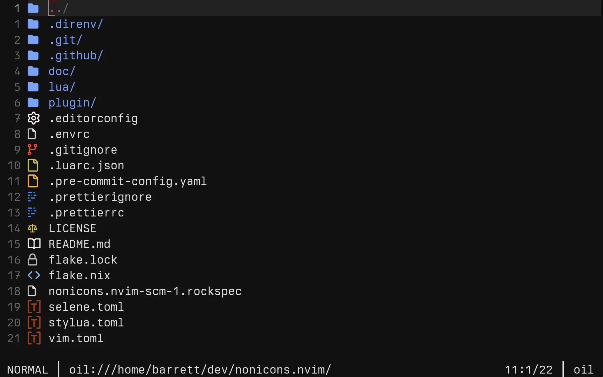

# nonicons.nvim

**[Nonicons](https://github.com/ya2s/nonicons) for Neovim**

> [!NOTE]
> Active development is hosted on
> [Forgejo](https://forge.barrettruth.com/barrettruth/nonicons.nvim).



## Features

- Replaces [nvim-web-devicons](https://github.com/nvim-tree/nvim-web-devicons)
  glyphs with nonicons font icons
- Any plugin using nvim-web-devicons works automatically

## Requirements

- [nonicons font](https://github.com/ya2s/nonicons/releases) installed
- (Optionally)
  [nvim-web-devicons](https://github.com/nvim-tree/nvim-web-devicons)

## Installation

With `vim.pack` (Neovim 0.12+):

```lua
vim.pack.add({
  'https://github.com/nvim-tree/nvim-web-devicons',
  'https://forge.barrettruth.com/barrettruth/nonicons.nvim',
})
```

Or via [luarocks](https://luarocks.org/modules/barrettruth/nonicons.nvim):

```
luarocks install nonicons.nvim
```

## Documentation

```vim
:help nonicons
```

## FAQ

**Q: How do I integrate with plugin `X`?**

See `:help nonicons-recipes`.

## Acknowledgements

- [ya2s/nonicons](https://github.com/ya2s/nonicons) — icon font
- [ya2s/nvim-nonicons](https://github.com/ya2s/nvim-nonicons) — original plugin
